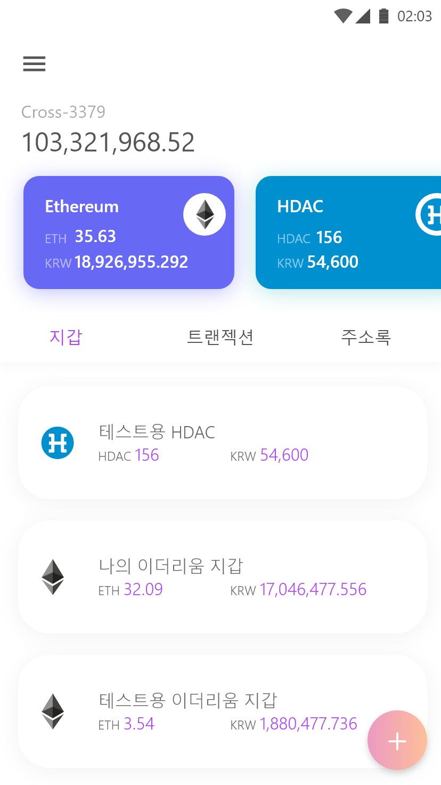
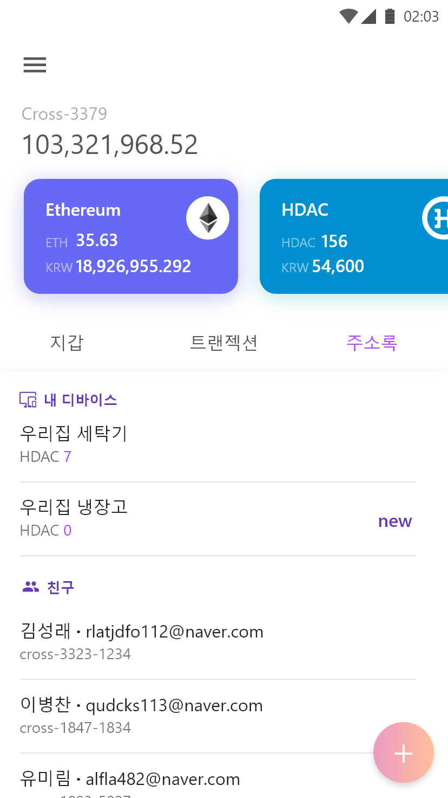
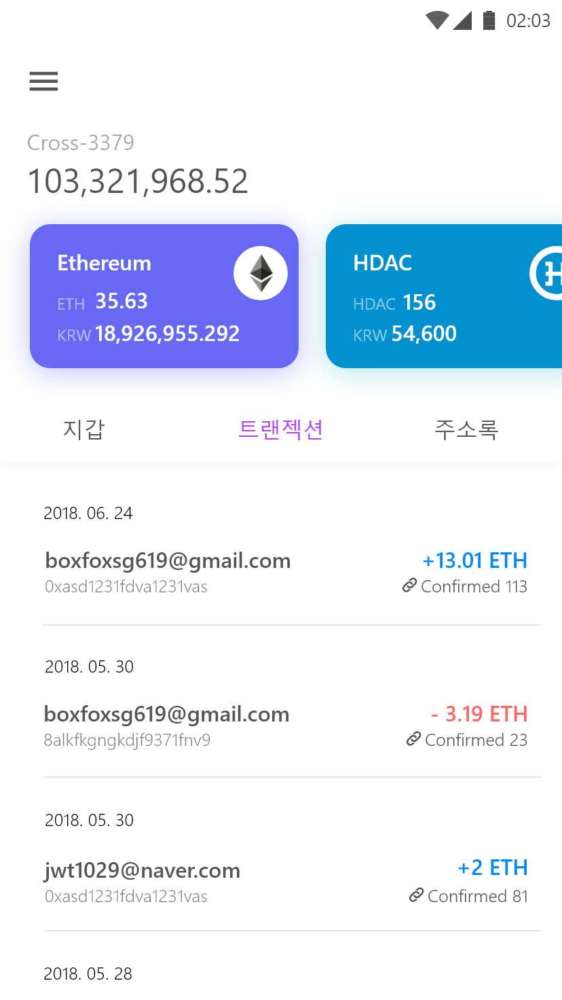
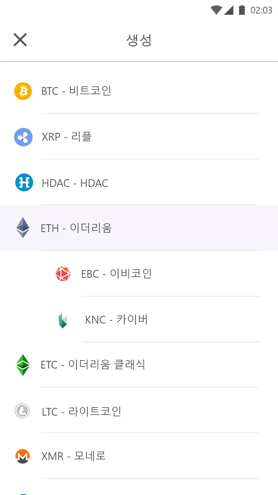
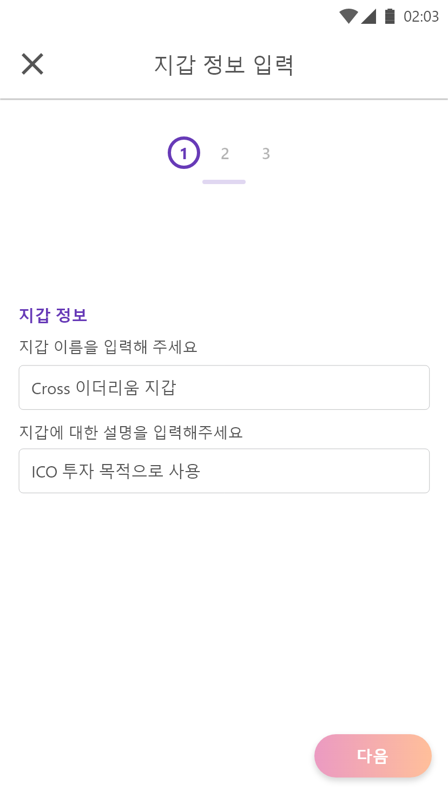
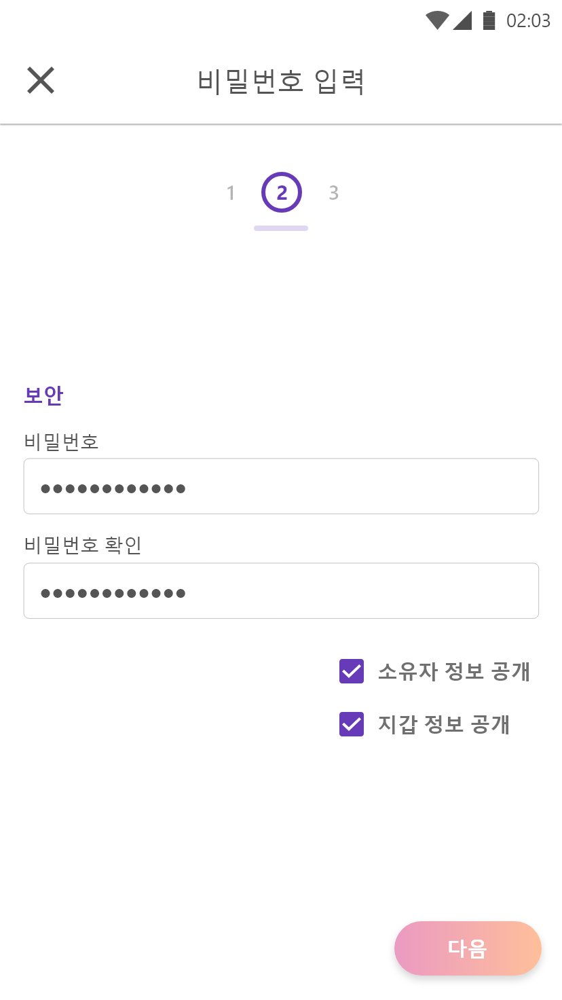
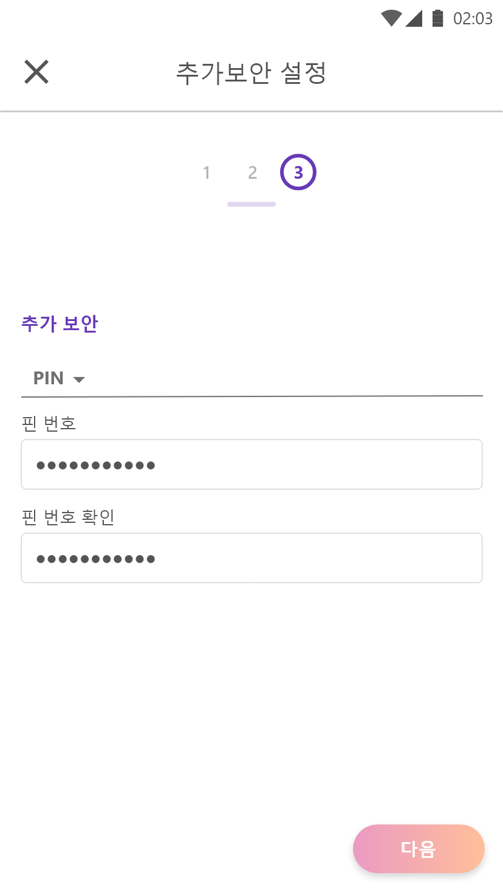

# Cross - 암호화폐 간편 송금 서비스
- 불편한 암호화폐 송금을 간편하게 하기 위해 진행중인 암호화폐 통합지갑 프로젝트.
- 각 종류별로 개발되는 암호화폐 지갑의 문제점을 개선하기 위해 다양한 암호화폐를 하나의 앱으로 관리하고 SNS 계정을 기반으로 복잡하고 긴 주소 없이 암호화폐를 송금할 수 있는 서비스.
- React Native로 마이그레이션 하여 현재 저장소는 사용되지 않습니다.

# Tech Stacks
- Kotlin
- Rx2
- Realm
- Retrofit2
- OkHttp3
- Firebase-Auth
- Facebook-Auth
- Picasso
- Reprint
- Scalablelayout

# Screenshots

# Extras
- 핀테크×블록체인 해커톤 참가
- 2018 HDAC 해커톤 참가 (아이디어상)
- BBR 청년학생 블록체인 해커톤 참가
